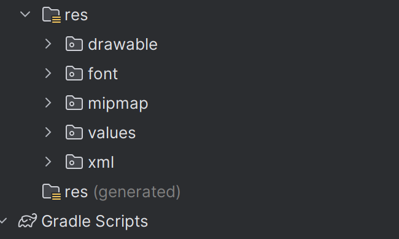
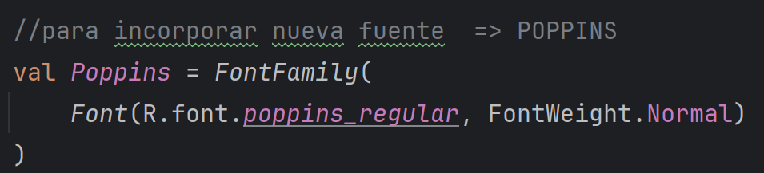
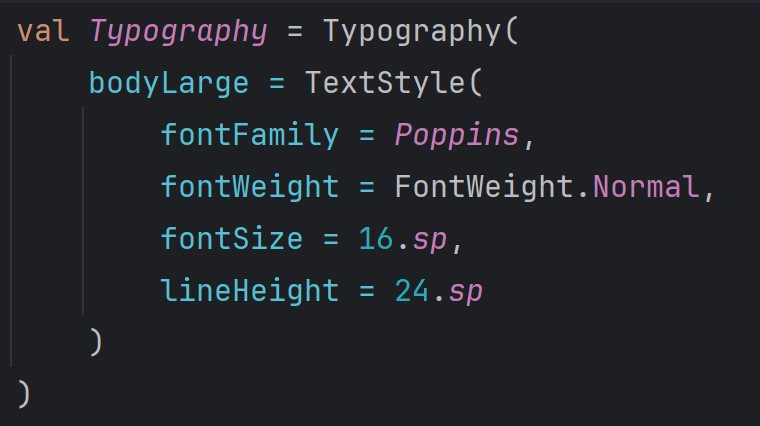
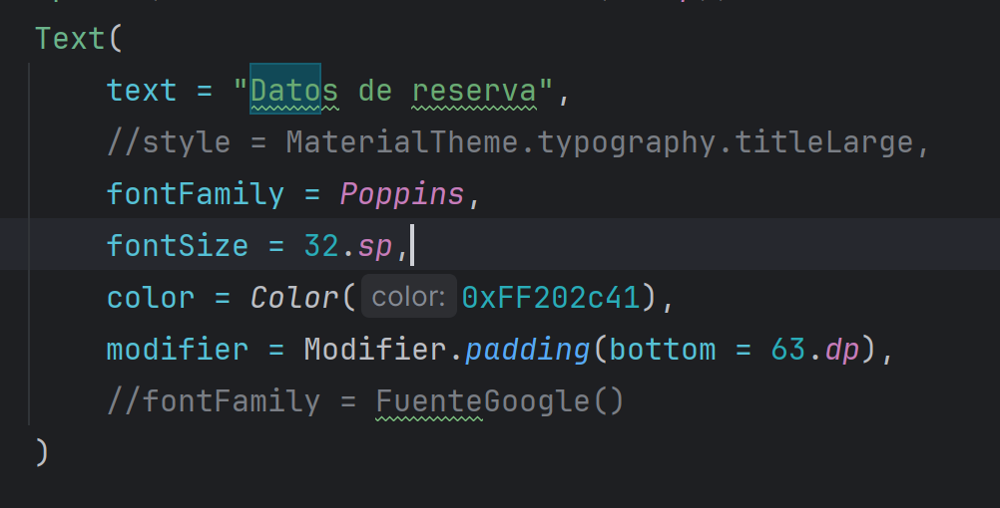

## INCORPORANDO MVVM _ apartado de login
por cada vista, vamos a tener crear una **CLASE** que tenga sujeto el nombre de ViewModel
    - por ejemplo de LoginScreen --> LoginViewModel

 >pero LoginViewModel => es una clase JavaClass no un Kotlin-File
 > https://youtu.be/EmUx8wgRxJw?si=dR8pwa_o45K5cuzc 
 > minuto 9:19
 

## APLICAR FUENTE A LA APLICACIÓN - pasos a seguir

1. descargamos la fuente de --> https://fonts.google.com/ (en este proyecto he descargado poppins)
2. en la carpeta res --> **creamos una carpeta font** res/font (a la altura de drawable) 
3. añadimos en el archivo **build-gradle :app** las siguientes _dependencias_
    `implementation ("androidx.compose.material3:material3:1.2.0")
     implementation("androidx.compose.ui:ui-text-google-fonts:1.2.0")`
4. copiamos los archivos con la extension **.ttf** a la carpeta **res/font** 
    > IMPORTANTE --> el nombre del archivo .ttf tiene q estar en minusculas y con "_" (poppins_reglar.ttf ---> no Poppins-Regular.ttf)
5. en el archivo **TYPE.KT**
   - incorporamos la fuente que vamos a querer utilizar 
   - definimos el esquema que va a tener nuestra tipografia en nuestro proyecto    
6. hacemos **llamada** de nuestra fuente en el texto al que la queramos incorporar 
   